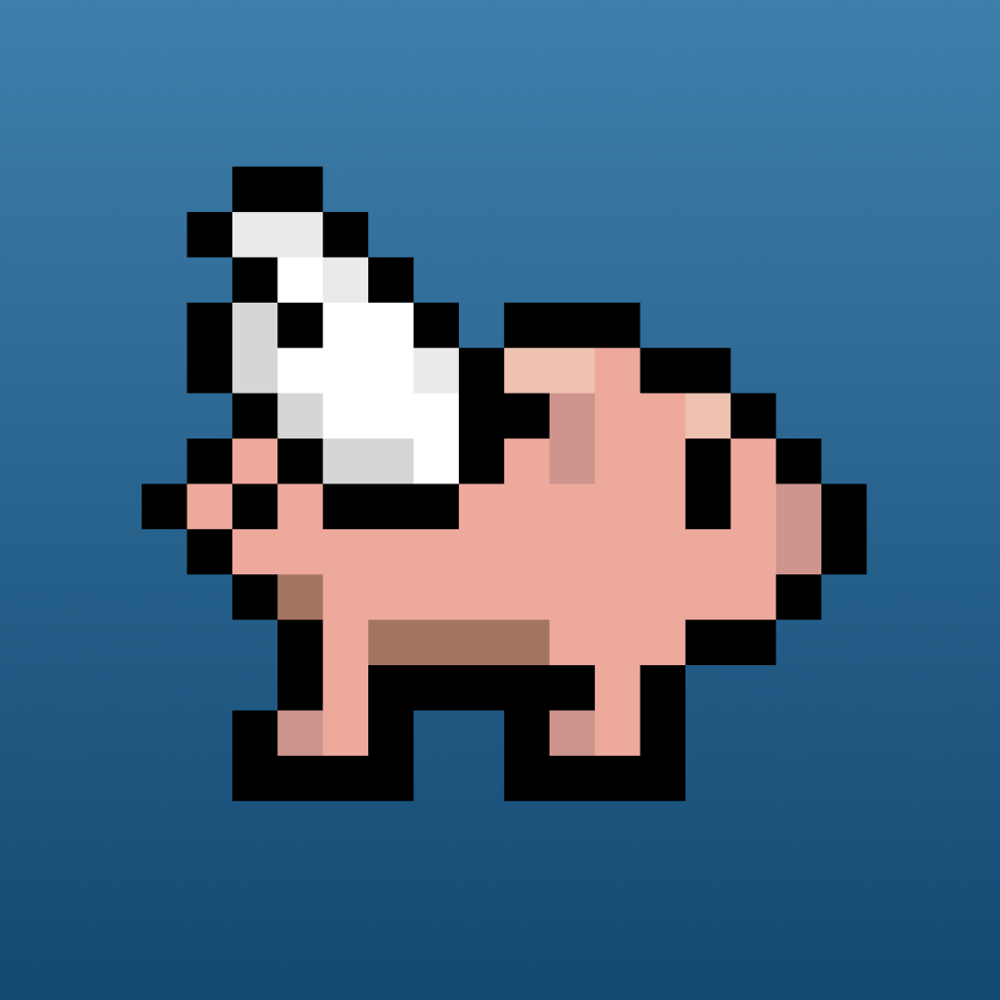
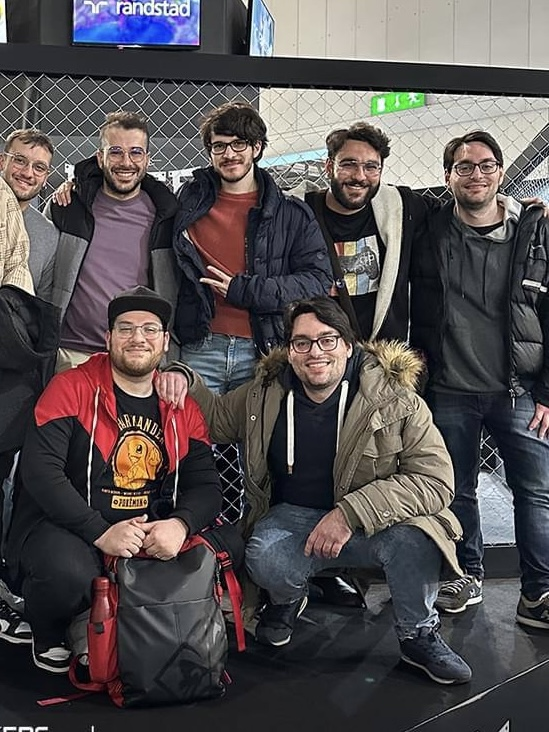
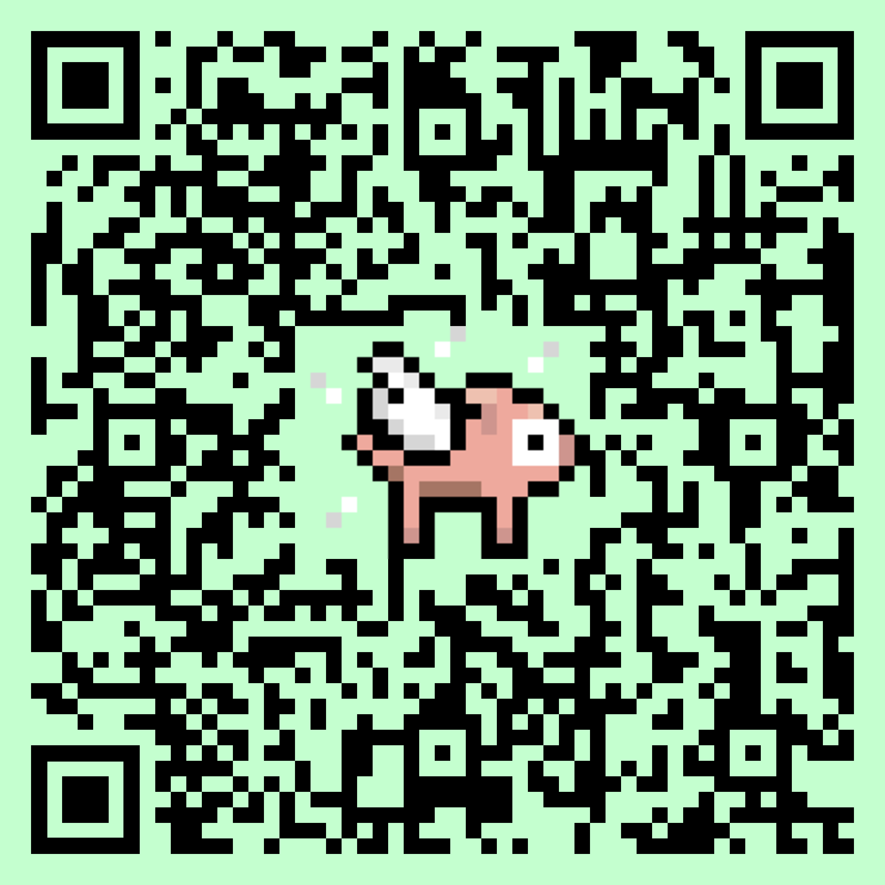
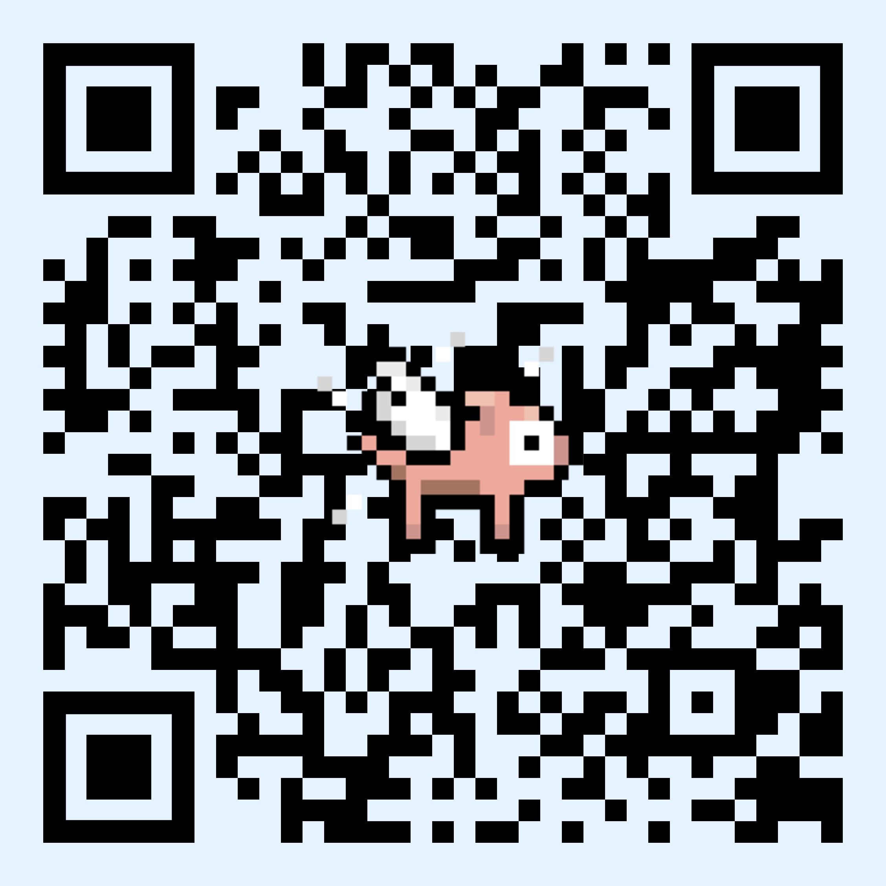

# Obsessive Odissey: Real Life Reckoning - Online Hackathon Randstad Technologies x Mkers x Bitdrome Winner Game

 

 
 
 
 

[Oreste Leone](https://orleonedev.github.io), [Riccardo Fasano](https://github.com/Ithil777), Fabio Vessillo, [Eugenio Raja](https://github.com/UnbuiltThunder4), Salvatore Luca Vessillo, [Giuseppe Falso](https://github.com/giuseppe-not-true), [Claudio Silvestri](https://github.com/Claudioios)

## About the Game

[**ITA**]
Obsessive Odissey è un gestionale in cui vestiamo i panni di un padre di famiglia alle prese con la propria famiglia e la sua passione per un gioco mobile nel quale è recentemente entrato a far parte della più importante gilda del mondo.
Alternandoti fra minigiochi frenetici e messaggi personali a risposta multipla, dovrai cercare di mantenere l'equilibrio fra lavoro, famiglia e gioco per riuscire a vincere il gioco della vita!

[**ENG**]
Obsessive Odissey is a mobile strategy game in which we play the role of a family man struggling to manage his family with his passion for a mobile game where he recently joined the most important guild in the world. Alternating between fast-paced mini-games and personal multiple-choice messages, you'll have to try to keep the balance between work, family and play in order to win the game of life!

## Where I can play?

[**ITA**]
Obsessive Odissey è attualmente nella sua fase di sviluppo pre-alpha per Android e iOS. Puoi provarlo scaricando il file .apk o unirti al TestFlight!

[**ENG**]
Obsessive Odissey is currently in it's pre-alpha development for Android and iOS. You can try it downloading the .apk file or join the TestFlight!

- **Android** - latest APK -> [GDrive](https://drive.google.com/drive/folders/14CC_2sCtXnMbXNMiwvWAFaxFoSiN8jnl?usp=share_link)

  
- **iOS & iPadOS** - Testflight link -> [Join TestFlight](https://testflight.apple.com/join/uYak5scv)

  
